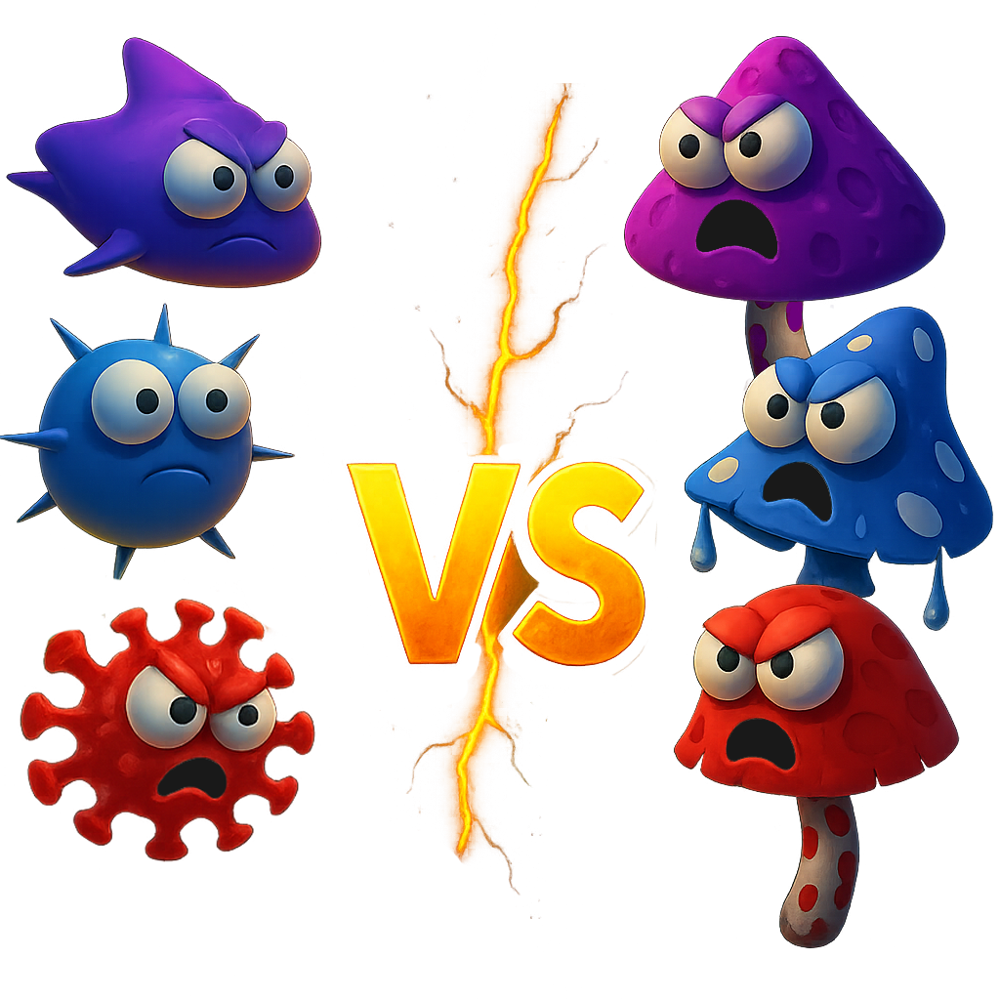

# Fungi vs. Bacteria



## Game Overview

**Fungi vs. Bacteria** is a strategic tower defense game set in a microscopic battlefield where players control a network of defensive fungi to protect environments from bacterial invasions. Players strategically place fungal towers along predefined paths to stop waves of bacteria from reaching critical points.

### Core Concept

- **Main Storyline:** Players control a network of defensive fungi to protect environments from bacterial invasions
- **Player's Goal:** Stop waves of bacteria from reaching critical points in the environment using strategic fungal tower placement
- **Setting:** Microscopic battlefield in various biomes (MVP: Dark Rainforest environment)

## MVP Features

### Core Gameplay

- **Path System:** Fixed paths for bacteria to follow with clear visual indicators
- **Resource System:** Starting currency (mycelium) for tower placement with auto-rewards from defeated bacteria
- **Tower System:** 4 basic tower types with unique abilities and upgrade paths
- **Enemy System:** 4 enemy types with different behaviors and characteristics

### Tower Types

1. **Mycelial Network** - Basic tower with low cost and basic damage
2. **Penicillium** - Damage tower with medium cost and high single-target damage
3. **Amanita** - Area effect tower with poison cloud effects
4. **Trichoderma** - Support tower with slowing cloud effects

### Enemy Types

1. **Basic Bacteria (Cocci)** - Normal speed and health
2. **Fast Bacteria (Spirillum)** - Fast speed with low health
3. **Armored Bacteria (Bacilli)** - Slower but tougher, resistant to single-target damage
4. **Boss Bacteria** - High health pool with basic attack patterns

## Technical Specifications

- **Engine:** Unity with C# scripting
- **Performance Target:** 60 FPS on mid-range devices
- **Architecture:** Component-based design with ScriptableObjects for data management
- **Optimization:** Object pooling system for enemies and efficient tower targeting

## Project Structure

```
Assets/
├── Audio/           # Sound effects and background music
├── Materials/       # 3D materials for enemies, towers, and environments
├── Meshes/          # 3D models for game objects
├── Prefabs/         # Prefabricated game objects
├── Scenes/          # Game scenes (MainMenu, MainGame)
├── Scripts/         # C# scripts organized by functionality
├── Settings/        # ScriptableObject configurations
└── Sprites/         # 2D UI elements and textures
```

## Development Guidelines

This project follows Unity best practices with:

- Modular tower system using ScriptableObjects
- Event-based communication between systems
- Clear separation between UI and game logic
- Performance optimization through object pooling
- Component-based architecture for reusability

## Getting Started

1. Open the project in Unity (compatible with recent Unity versions)
2. Navigate to `Assets/Scenes/MainMenu.unity` to start
3. Configure Unity project settings for version control (see below)

---

## Configure Unity YAML Merge (Smart Merge)

#### 1. Locate UnityYAMLMerge:

UnityYAMLMerge is included with your Unity installation. On macOS, you can find it at:

```
/Applications/Unity/Hub/Editor/[UnityVersion]/Unity.app/Contents/Tools/UnityYAMLMerge
```

Replace [UnityVersion] with your specific Unity version, e.g., 6000.0.25f1.

#### 2. Modify/Add the merge section in your `.git/config` file:

```
[merge "unityyamlmerge"]
    name = Unity SmartMerge (UnityYAMLMerge)
    driver = /Applications/Unity/Hub/Editor/[UnityVersion]/Unity.app/Contents/Tools/UnityYAMLMerge merge -p %O %A %B %A
    recursive = binary
```

#### 3. Create or Modify .gitattributes:

In your project's root directory, create or edit the .gitattributes file to specify which files should use the custom merge driver:

```
# Unity YAML files
*.unity  merge=unityyamlmerge
*.prefab merge=unityyamlmerge
*.asset  merge=unityyamlmerge
*.meta   merge=unityyamlmerge
```

This configuration tells Git to use UnityYAMLMerge for merging the specified file types.

#### 4. Configure Unity Project Settings:

Within Unity, adjust your project settings to facilitate better version control integration:

- Navigate to `Edit > Project Settings > Editor`.
- Set `Version Control mode` to `Visible Meta Files`.
- Set `Asset Serialization mode` to `Force Text`.

These settings ensure that Unity assets are stored in a text-based format, making them more suitable for version control systems.

#### 5. Handling Merge Conflicts:

When a merge conflict occurs:

- Run `git mergetool` in your terminal.
- Git will invoke UnityYAMLMerge for the specified file types.
- If UnityYAMLMerge cannot automatically resolve a conflict, it will prompt you to resolve it manually.
